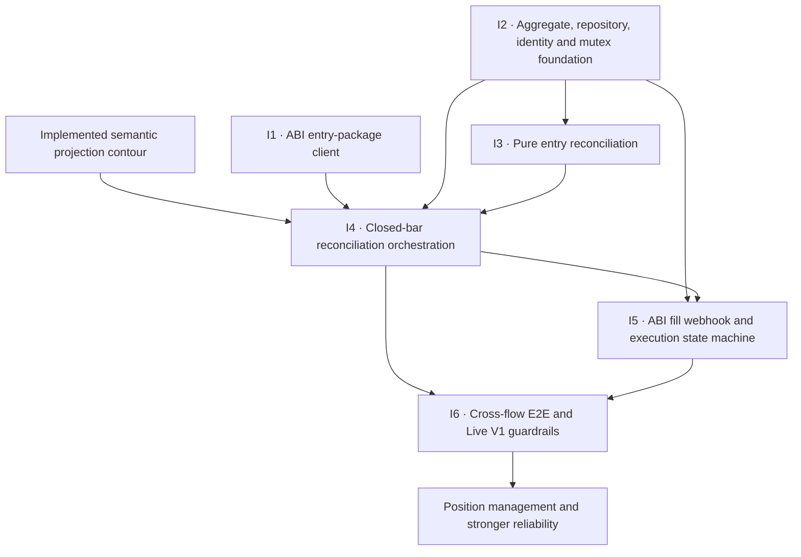

# Runtime ↔ ABI entry delivery map

Status: living implementation map for the live-entry half of the Runtime ↔ ABI
pipeline.

This document turns
[`runtime-abi-entry-reconciliation-master-plan.md`](runtime-abi-entry-reconciliation-master-plan.md)
into independently deliverable increments. The master plan remains the
architectural source of truth; this file tracks sequencing and implementation
progress.

Interactive views:

- [`runtime-abi-entry-delivery-map.html`](runtime-abi-entry-delivery-map.html) —
  standalone call-chain map with switchable current, closed-bar, ABI webhook,
  and delivery-increment views;
- [`runtime-abi-entry-delivery-map.fragment.html`](runtime-abi-entry-delivery-map.fragment.html) —
  editable visualization source.

The checkboxes inside the interactive view are stored locally by the browser.
The checklist below is the Git-tracked canonical progress record.

## Delivery dependency map

## Canonical implementation progress

### I1 · ABI entry-package client

- [x] Proposal, design, specification, and task plan completed in
  `openspec/changes/abi-entry-package-client-v1`.
- [ ] Closed request and response DTOs implemented.
- [ ] Scalar `AbiEntryPackagePort` implemented.
- [ ] Bounded non-retried HTTP adapter implemented.
- [ ] Strict success, public-error, transport, and protocol decoding implemented.
- [ ] Fake-ABI contract tests implemented.
- [ ] ABI OpenAPI conformance verification implemented.
- [ ] Change verified and archived.

Exit condition: Runtime owns a tested outbound ABI client that remains
unconnected to reconciliation and production composition.

### I2 · Aggregate, repository, identity and mutex foundation

- [x] Create and approve the `runtime-entry-state-foundation-v1` OpenSpec
  change.
- [x] Add canonical Runtime-owned `risk_multiplier = "1"` to newly created
  strategy-instance
  state without resetting it on rediscovery.
- [x] Keep multiplier outside deployment, registration requests, `raw_spec`,
  registered snapshots, and identity derivation.
- [x] Replace the provisional cycle with minimal `CurrentTradeCycle`:
  `trade_cycle_id + applied_entry_package`.
- [x] Add minimal `AppliedEntryPackage`: `applied_desired_entry +
  calculated_quantity`.
- [x] Keep phases, fill state, `FrozenExecutedEntryContext`, and
  position-management state outside I2.
- [x] Add repository load and complete-aggregate save operations.
- [x] Add Runtime-owned `trade_cycle_id` factory semantics.
- [x] Add the process-local keyed-mutex registry for later writer flows.
- [x] Add aggregate, repository, identity, and mutex tests.

Exit condition: Runtime can safely load, mutate, and save one strategy-instance
aggregate inside a per-instance critical section without calling ABI.

### I3 · Pure entry reconciliation

- [x] Create, approve, implement, verify, synchronize, and archive
  `runtime-entry-reconciliation-v1`.
- [x] Define exact `DesiredEntry` equivalence with no multiplier input.
- [x] Implement closed `NoOp`, `Apply`, `Replace`, and `Cancel` decision
  variants with payloads.
- [x] Implement command construction for present and absent entry packages using
  `EntryPackageRequest`.
- [x] Keep `risk_multiplier` completely outside I3 reconciliation, decision
  payloads, command models, acknowledgement validation, applied package state,
  transitions, equivalence, and tests.
- [x] Implement fail-closed acknowledgement-to-state transition rules with one
  `EntryReconciliationInvariantError`.
- [x] Preserve source-state value and avoid any state transition for `NO_OP`,
  contradictory input, unconfirmed outcomes, and transport/protocol failures
  handled later by I4.
- [x] Add exhaustive decision-table, command-builder, state-applier,
  architecture-boundary, and model-shape tests.

Exit condition: pure components can derive one command and apply one valid
acknowledgement without transport, HTTP, or composition dependencies.

### I4 · Closed-bar reconciliation orchestration

- [ ] Create and approve a dedicated OpenSpec change.
- [ ] Add `EntryReconciliationOrchestrator`.
- [ ] Hold the keyed mutex across load, decision, bounded ABI call, state
  application, and save.
- [ ] Reserve a new `trade_cycle_id` for `APPLY` without creating
  `CurrentTradeCycle` before acknowledgement.
- [ ] Reuse the acknowledged cycle identity for `REPLACE` and `CANCEL`.
- [ ] Preserve state on public ABI errors, timeout, network failure, and protocol
  failure.
- [ ] Connect the semantic orchestrator to `StrategyCycleHandoffBoundary` in
  production composition.
- [ ] Complete the required Strategy Engine and ABI position-lookup production
  adapters or inject their production implementations.
- [ ] Add closed-bar integration tests through a fake ABI.

Exit condition: a live-entry projection can reach ABI and persist only a valid,
identity-bound acknowledgement.

### I5 · ABI fill webhook and execution state machine

- [ ] Confirm the ABI/Bybit cumulative quantity and average-price source.
- [ ] Create and approve a dedicated OpenSpec change.
- [ ] Define the Runtime ABI fill-event HTTP contract.
- [ ] Add the fill-event HTTP handler without direct aggregate mutation.
- [ ] Add `AbiExecutionEventOrchestrator`.
- [ ] Load state only after acquiring the shared keyed mutex.
- [ ] Validate `strategy_instance_id + trade_cycle_id`.
- [ ] Freeze executed entry context on the first fill.
- [ ] Implement partial and full fill phase transitions.
- [ ] Persist cumulative quantities, average entry price, and first/last fill
  timestamps.
- [ ] Add webhook contract and execution state-machine tests.

Exit condition: ABI partial and final fills update the matching acknowledged
cycle through the same serialized repository boundary as closed-bar
reconciliation.

### I6 · Cross-flow E2E and Live V1 guardrails

- [ ] Add reconciliation-versus-webhook contention tests.
- [ ] Add the accepted Live V1 cancel/fill race test matrix.
- [ ] Verify mutex release on every success and failure path.
- [ ] Verify bounded ABI timeouts and no automatic retries.
- [ ] Add end-to-end tests from closed-bar input through acknowledgement and fill.
- [ ] Add operational journal or metrics for reconciliation and fill outcomes.
- [ ] Enforce or verify the single-process, single-worker deployment constraint.
- [ ] Run complete pytest, Ruff, mypy, compilation, and OpenSpec validation.

Exit condition: both Runtime writer paths are verified together under the
explicit Live V1 reliability boundary.

## Decisions required before I4

- [x] Reconcile cancellation vocabulary for I3: a confirmed cancel uses
  `EntryPackageAbsent`.
- [x] Define the persisted I3 `AppliedEntryPackage` summary:
  `applied_desired_entry + calculated_quantity`.
- [x] Confirm I3 is unaware of `risk_multiplier`; I4 may read the existing
  `StrategyInstanceRuntimeState.risk_multiplier` directly at the actual ABI
  call boundary if the current ABI client still needs that value.
- [ ] Decide whether the production Strategy Engine and ABI open-position HTTP
  adapters belong to I4 or to a prerequisite composition change.

## Explicitly deferred

- [ ] Open-trade protection and close reconciliation.
- [ ] Stop/take replacement after entry.
- [ ] Partial-entry remainder and timeout policy.
- [ ] Durable fill-event deduplication.
- [ ] Persisted pending commands and ambiguous-outcome recovery.
- [ ] Repository revisions/CAS and ABI command idempotency.
- [ ] Multi-worker, multi-replica, and distributed coordination.

## Updating this map

1. Update the canonical checklist in this Markdown file.
2. Update the corresponding step status or wording in
   `runtime-abi-entry-delivery-map.fragment.html`.
3. Regenerate `runtime-abi-entry-delivery-map.html` from the fragment.
4. Review both files in the same change as the implementation whose status
   changed.
