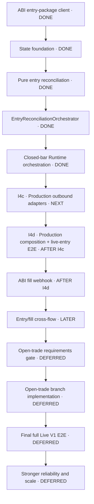

# Runtime ↔ ABI entry delivery map

Status: living implementation map for the live-entry half of the Runtime ↔ ABI
pipeline.

This document turns
[`runtime-abi-entry-reconciliation-master-plan.md`](runtime-abi-entry-reconciliation-master-plan.md)
into independently deliverable increments. The master plan remains the
architectural source of truth; this file tracks sequencing and implementation
progress.

Interactive views:

- [`runtime-abi-entry-delivery-map.html`](runtime-abi-entry-delivery-map.html) —
  standalone call-chain map with switchable current, closed-bar, ABI webhook,
  and delivery-increment views;
- [`runtime-abi-entry-delivery-map.fragment.html`](runtime-abi-entry-delivery-map.fragment.html) —
  editable visualization source.

The checkboxes inside the interactive view are stored locally by the browser.
The checklist below is the Git-tracked canonical progress record.

## Delivery dependency map

## Canonical implementation progress

### I1 · ABI entry-package client

- [x] Proposal, design, specification, and task plan completed.
- [x] Closed request and response DTOs implemented.
- [x] Scalar `AbiEntryPackagePort` implemented.
- [x] Bounded non-retried HTTP adapter implemented.
- [x] Strict success, public-error, transport, and protocol decoding implemented.
- [x] Fake-ABI contract tests implemented.
- [x] ABI OpenAPI conformance verification implemented for the then-approved
  contract.
- [x] Change verified and archived as
  `openspec/changes/archive/2026-07-26-abi-entry-package-client-v1`.

Exit condition: Runtime owns a tested outbound ABI client that remains
unconnected to reconciliation and production composition.

### I2 · Aggregate, repository, identity and mutex foundation

- [x] Create and approve the `runtime-entry-state-foundation-v1` OpenSpec
  change.
- [x] Add the canonical Runtime-owned strategy-instance aggregate and preserve
  the existing aggregate across rediscovery.
- [x] Replace the provisional cycle with minimal `CurrentTradeCycle`:
  `trade_cycle_id + applied_entry_package`.
- [x] Add minimal `AppliedEntryPackage`: `applied_desired_entry +
  calculated_quantity`.
- [x] Keep phases, fill state, `FrozenExecutedEntryContext`, and
  position-management state outside I2.
- [x] Add repository load and complete-aggregate save operations.
- [x] Add Runtime-owned `trade_cycle_id` factory semantics.
- [x] Add the process-local keyed-mutex registry for later writer flows.
- [x] Add aggregate, repository, identity, and mutex tests.

Exit condition: Runtime can safely load, mutate, and save one strategy-instance
aggregate inside a per-instance critical section without calling ABI.

### I3 · Pure entry reconciliation

- [x] Create, approve, implement, verify, synchronize, and archive
  `runtime-entry-reconciliation-v1`.
- [x] Define exact `DesiredEntry` equivalence.
- [x] Implement closed `NoOp`, `Apply`, `Replace`, and `Cancel` decision
  variants with payloads.
- [x] Implement transport-free command construction for present and absent
  entry packages using `EntryReconciliationCommand`.
- [x] Implement fail-closed acknowledgement-to-state transition rules with one
  `EntryReconciliationInvariantError`.
- [x] Preserve source-state value and avoid any state transition for `NO_OP`,
  contradictory input, and unconfirmed outcomes; I4a now composes these pure
  rules with the external execution boundary.
- [x] Add exhaustive decision-table, command-builder, state-applier,
  architecture-boundary, and model-shape tests.

Exit condition: pure components can derive one command and apply one valid
acknowledgement without transport, HTTP, or composition dependencies.

### I4a · Entry reconciliation application operation — DONE

- [x] Implement and archive
  `entry-reconciliation-orchestrator-v1`.
- [x] Implement `EntryReconciliationOrchestrator.execute(projection)` with one
  `LiveEntryProjectedStrategyInstance` input.
- [x] Extract `source_state` from
  `projection.source.resolved_state.runtime_state`.
- [x] Add the narrow application execution port over
  `EntryReconciliationCommand + StrategyInstanceRuntimeState`.
- [x] Reserve a cycle identity exactly once and only for `Apply`; reuse the
  current-cycle identity for `Replace` and `Cancel`.
- [x] Complete `NoOp` without identity reservation, command construction,
  external execution, or state application.
- [x] Execute one external call for every command-bearing decision.
- [x] Allow state application only after a valid successful confirmation.
- [x] Return only unchanged or complete replacement aggregate state.
- [x] Enforce one-way pure-to-application architecture separation and keep
  mutex, repository load/save, transport adaptation, and production composition
  outside the nested component.

Exit condition: a tested nested application operation can reconcile one
live-entry projection against the exact aggregate embedded in its provenance,
without owning the upper closed-bar workflow.

### I4b · Closed-bar Runtime orchestration — DONE

- [x] Create and approve a dedicated OpenSpec change
  (`closed-bar-runtime-orchestration-v1`).
- [x] Extend the existing `StrategyRuntimeOrchestrator`; do not introduce
  another top-level closed-bar or projection orchestrator.
- [x] Make `StrategyRuntimeOrchestrator` own the keyed mutex across state load,
  ABI position lookup, Engine projection, typed branching, reconciliation,
  save, and every failure path.
- [x] Load the aggregate only after acquiring the mutex.
- [x] Perform ABI position lookup and Engine projection inside the critical
  section.
- [x] Branch on the typed projection result.
- [x] Route `LiveEntryProjectedStrategyInstance` into the already implemented
  `EntryReconciliationOrchestrator.execute(projection)`.
- [x] Save replacement state when the nested operation reports a logical
  transition.
- [x] Make `StrategyRuntimeOrchestrator.process(unit)` fail explicitly for
  `OpenTradeProjectedStrategyInstance`; the handoff must not record or report
  that dispatch as successful.
- [x] Release the mutex on every success and failure path.
- [x] Add closed-bar orchestration, failure-path, and mutex-ownership tests.
- [x] Change verified and archived as
  `openspec/changes/archive/2026-07-28-closed-bar-runtime-orchestration-v1`.

Exit condition: one closed-bar invocation is serialized from state load through
projection and live-entry application, and it persists only a valid,
identity-bound acknowledgement.

Production adapter and composition scope was intentionally decided only after
closed-bar application orchestration was designed and after the actual
existing Strategy Engine, ABI position-lookup, ABI entry-package, and
bootstrap interfaces were inspected. That inspection is now formalized below as
`I4c` and `I4d`; they are the same production integration seam this map always
carried, not a newly discovered stage. See
[`runtime-live-entry-production-integration-plan.md`](runtime-live-entry-production-integration-plan.md)
for the full contract detail behind both.

### I4c · Production outbound adapters — NEXT

Change name: `runtime-production-outbound-adapters-v1`.

- [ ] Create and approve the OpenSpec change.
- [ ] Implement the Strategy Engine `StrategyEngineLiveEntryPort` HTTP adapter
  against `POST /v1/strategy-evaluations/live-entry`.
- [ ] Implement the Strategy Engine `StrategyEngineOpenTradePort` HTTP adapter
  against `POST /v1/strategy-evaluations/open-trade` (required by
  `StrategyUseCaseRouter` even though the first E2E only exercises live-entry).
- [ ] Implement the `AbiOpenPositionLookupPort` HTTP adapter against the
  ABI open-position contract fixed in the focused plan.
- [ ] Implement the `EntryReconciliationExecutionPort` → `AbiEntryPackagePort`
  bridge adapter (`EntryReconciliationCommand` + `source_state` →
  `EntryPackageRequest` → ABI client → `EntryAppliedConfirmation` /
  `EntryAbsentConfirmation`).
- [ ] Remove the obsolete `EntryPackageApplied.accepted_risk_multiplier`
  response echo from the ABI entry-package client DTO; `risk_multiplier`
  travels to ABI one-way and is never returned or reconfirmed.
- [ ] Enforce strict DTOs, URL encoding, bounded timeouts, no retry, no
  redirect, and typed network/timeout/protocol/public-error decoding on every
  new adapter.
- [ ] Add fake-HTTP contract tests for each adapter.

Exit condition: all production outbound dependencies can be created and tested
in isolation, but are not yet connected to the application or bootstrap.

### I4d · Production composition and live-entry vertical slice — AFTER I4c

Change name: `runtime-live-entry-production-composition-v1`.

- [ ] Create and approve the OpenSpec change.
- [ ] Add `RUNTIME_STRATEGY_ENGINE_BASE_URL`,
  `RUNTIME_STRATEGY_ENGINE_TIMEOUT_SECONDS`, `RUNTIME_ABI_BASE_URL`,
  `RUNTIME_ABI_OPEN_POSITION_TIMEOUT_SECONDS`, and
  `RUNTIME_ABI_ENTRY_PACKAGE_TIMEOUT_SECONDS` to Runtime configuration.
- [ ] Compose one production graph: MDS closed-bar HTTP webhook →
  `FilesystemDeploymentCatalog` → `CommittedBarDeploymentSelector` →
  `CommittedBarOrchestrator` → `StrategyCycleHandoffBoundary` →
  `StrategyRuntimeOrchestrator` (shared repository, shared keyed-mutex
  registry) → `OpenPositionResolver` (ABI adapter) → `StrategyUseCaseRouter`
  (Engine live-entry/open-trade adapters) →
  `EntryReconciliationOrchestrator` → execution adapter → ABI entry-package
  client.
- [ ] Own exactly one repository instance and one keyed-mutex registry for the
  application lifetime; I5 reuses both.
- [ ] Bound HTTP client lifetimes and add clean shutdown.
- [ ] Fail startup readiness when production configuration is invalid.
- [ ] Default the handoff to the wired semantic Runtime; keep test overrides
  available but not the production default.
- [ ] Add a vertical integration test: `POST /v1/webhooks/closed-bar` →
  selected deployment → ABI `position_open=false` → Engine `desired_entry` →
  reconciliation `APPLY` → ABI entry-package acknowledgement → state save →
  `CurrentTradeCycle`.
- [ ] Add failure-path tests: `desired_entry=null`, Engine error, ABI
  position-lookup error, ABI entry-package rejection, timeout, zero retry,
  failed dispatch journal outcome.

Exit condition: Runtime is fully wired end to end for the live-entry branch —
MDS webhook → Engine → ABI client → acknowledged Runtime state — with a real
executor bot optionally still replaced by a fake ABI.

### I5 · ABI fill webhook and execution state machine — AFTER I4d

- [ ] Confirm the ABI/Bybit cumulative quantity and average-price source.
- [ ] Create and approve a dedicated OpenSpec change.
- [ ] Define the Runtime ABI fill-event HTTP contract.
- [ ] Add the fill-event HTTP handler without direct aggregate mutation.
- [ ] Add `AbiExecutionEventOrchestrator`.
- [ ] Load state only after acquiring the shared keyed mutex.
- [ ] Validate `strategy_instance_id + trade_cycle_id`.
- [ ] Freeze executed entry context on the first fill.
- [ ] Implement partial and full fill phase transitions.
- [ ] Persist cumulative quantities, average entry price, and first/last fill
  timestamps.
- [ ] Add webhook contract and execution state-machine tests.

Exit condition: ABI partial and final fills update the matching acknowledged
cycle through the same serialized repository boundary as closed-bar
reconciliation.

### I6 · Entry/fill cross-flow E2E and guardrails

- [ ] Add reconciliation-versus-webhook contention tests.
- [ ] Add the accepted Live V1 cancel/fill race test matrix.
- [ ] Verify mutex release on every success and failure path.
- [ ] Verify bounded ABI timeouts and no automatic retries.
- [ ] Add end-to-end tests from closed-bar input through acknowledgement and fill.
- [ ] Add operational journal or metrics for reconciliation and fill outcomes.
- [ ] Enforce or verify the single-process, single-worker deployment constraint.
- [ ] Run complete pytest, Ruff, mypy, compilation, and OpenSpec validation.

Exit condition: the entry-reconciliation and fill-webhook writer paths are
verified together under the explicit Live V1 concurrency boundary. This is an
entry/fill milestone, not final full Live V1 readiness.

### Open-trade gate and final Live V1

- [ ] Define open-trade branch requirements from the first post-fill committed
  bar onward.
- [ ] Design and implement the branch without preassigning a component name.
- [ ] Replace the explicit unsupported outcome only after that implementation is
  verified.
- [ ] Run final full Live V1 E2E across entry, fills, open-trade routing, and
  position management.

Exit condition: both typed projection branches are supported before Runtime is
described as fully Live V1 ready.

## Decisions required before closed-bar Runtime orchestration

- [x] Reconcile cancellation vocabulary for I3: a confirmed cancel uses
  `EntryPackageAbsent`.
- [x] Define the persisted I3 `AppliedEntryPackage` summary:
  `applied_desired_entry + calculated_quantity`.
- [x] Closed-bar application orchestration is designed first.
- [x] Production adapter and composition scope is decided after inspecting the
  actual existing service interfaces.

## Explicitly deferred

- [ ] Open-trade protection and close reconciliation remains outside I1–I6 and
  is governed by the explicit gate above.
- [ ] Stop/take replacement after entry.
- [ ] Partial-entry remainder and timeout policy.
- [ ] Durable fill-event deduplication.
- [ ] Persisted pending commands and ambiguous-outcome recovery.
- [ ] Repository revisions/CAS and ABI command idempotency.
- [ ] Multi-worker, multi-replica, and distributed coordination.

## Updating this map

1. Update the canonical checklist in this Markdown file.
2. Update the corresponding step status or wording in
   `runtime-abi-entry-delivery-map.fragment.html`.
3. Regenerate `runtime-abi-entry-delivery-map.html` from the fragment with title
   `Runtime ABI Entry Delivery Map` and preserve same-origin browser storage for
   tracked checkboxes.
4. Review both files in the same change as the implementation whose status
   changed.
